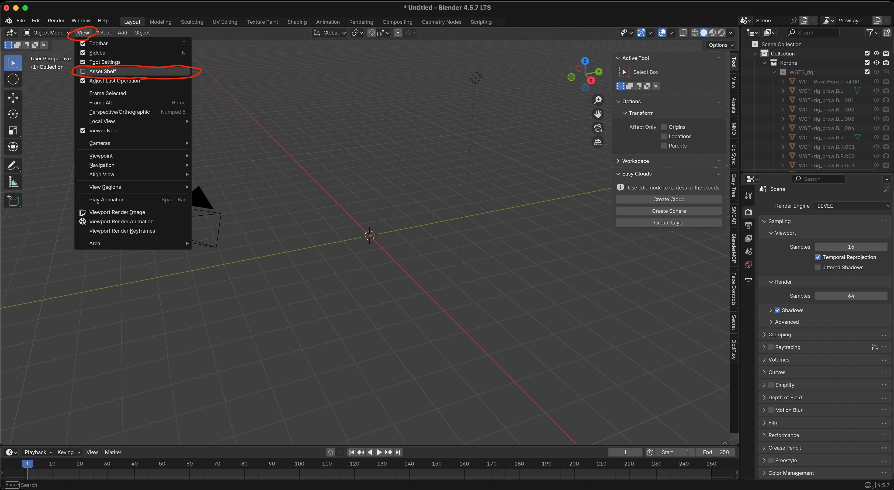
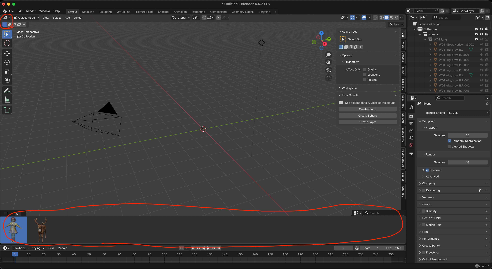

# 3D Viewport Asset Shelf Enabler

[English](README.md) | [日本語](README.ja.md)

3D Viewport でシンプルな Asset Shelf を有効化する Blender 4.5 以降向け Extension です。

## 機能

- 3D Viewport に Asset Shelf を追加します。
- Shelf はデフォルトでは非表示です。

## インストール

### ディスクからインストール

この Extension は公式の Blender Extensions プラットフォームには掲載されていません。

1. この Extension の `.zip` パッケージをダウンロードします。
2. Blender で `編集 > プリファレンス > Get Extensions` を開きます。
3. 右上のメニューから `Install from Disk...` を選びます。
4. ダウンロードした `.zip` ファイルを選択してインストールします。
